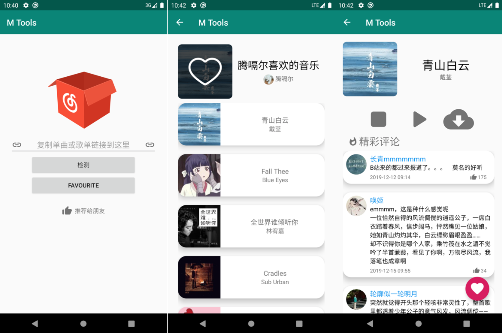
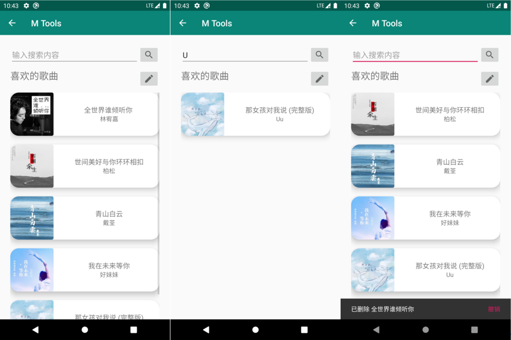

中文 | [English](README.md)

# 网易云音乐下载器

一个通过识别网易云音乐/歌单分享链接，并使用网易API获取数据实现播放、下载歌曲，显示歌曲热门评论或将歌曲加入到软件内歌单的应用。

这个项目是"移动应用开发实训"课程的期末大作业。[任务清单](TaskList.md)

其中使用到了：
- [Material Design](https://material.io/design/) - 美化界面
- [OkHttp](https://github.com/square/okhttp) - 从网络获取数据
- [Jackson](https://github.com/FasterXML/jackson) - 处理JSON
- [Glide](https://github.com/bumptech/glide) - 加载图片
- [Glide-Transformations](https://github.com/wasabeef/glide-transformations) - 辅助Glide更加多样化地加载图片
- [Android-Debug-Database](https://github.com/amitshekhariitbhu/Android-Debug-Database) - 程序调试

## 用法

    使用 Android Studio 编译运行即可
    需要 Android API >= 29
    
## 运行截图

## 许可证
